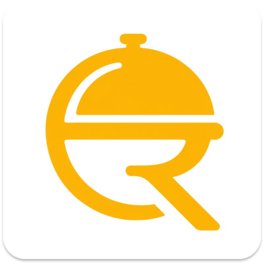

# Restaurant Management System (RMS)

**API repository**

<br>
<div align="center">
  
</div>
<br><br>


Robust, scalable API that processes restaurant operations in real-time and transforms data into actionable business insights.


## Context

Our first project, ROS, focused exclusively on order management. While it worked well for that specific task, we realized restaurants needed more—they needed a system that understood their entire business.

This new platform represents our evolution: a comprehensive Restaurant Management System built around real business needs. We're not just tracking orders anymore; we're helping managers make smarter decisions with data-driven insights that drive actual growth.

## Features

### Core Business
- **Orders** – Full order lifecycle (QUEUE → PREPARING → READY → DELIVERED) with real-time status tracking
- **Products** – Menu catalog with categories, pricing, recipes, and images
- **Special Selections** – Configurable combos with groups, additions, and scheduling
- **Inventory** – Stock management with automatic deductions on sales and inter-location transfers
- **Purchases** – Supplier management and purchase orders that update inventory

### Operations
- **Schedule** – Work schedules, shift management, and worker assignments
- **Time Logs** – Clock in/out tracking for attendance and payroll calculation
- **Areas & Tables** – Restaurant zones and table management with occupancy tracking

### Financials
- **Payroll** – Monthly payroll with events (overtime, bonuses, deductions) and settlement tracking
- **Cost Calculation** – Real-time product cost breakdown (materials + labor) based on actual payroll data
- **Analytics** – Prime cost & margins, menu engineering BCG analysis

### Security
- **Authentication** – JWT-based login with refresh tokens
- **2FA** – Two-factor authentication support
- **Password Reset** – Email-based recovery flow
- **Role-Based Access** – Admin and Worker roles with endpoint-level authorization

### Developer Experience
- **Swagger UI** – Interactive API documentation at `/swagger-ui/index.html`
- **OpenAPI 3.1** – Machine-readable API contract
- **Hexagonal Architecture** – Clean separation of domain, application, and infrastructure layers

---

## Technologies We're Using

The Aros system is built on a modern and scalable stack, optimized for cloud-native performance and security:

- **Core Framework:**  Spring Boot 4.0.3 running on Java 21, leveraging the latest performance enhancements and virtual threads for high concurrency.

- **Data Persistence:** MySQL 7.4, managed via Spring Data JPA to ensure relational integrity, ACID compliance, and efficient transaction handling.

- **Gradle:** As the build automation tool and dependency manager.

- **Docker:** For application containerization, ensuring consistency across development and production environments.


## Requirements

Before running this project, ensure you have installed:

- [Docker Engine](https://docs.docker.com/engine) – required for building and running the application
- [Taskfile](https://taskfile.dev/docs/installation) – to simplify command execution


## First steps

- **Run the project:**
  ```
  task run
  ```

- **Build the project:**
  ```
  # This command runs tests and then generates a Docker image
  task build
  ```

- **Format the code:**
  ```
  task format
  ```

- **API Documentation:**
  Access Swagger UI at: http://localhost:8080/swagger-ui/index.html
